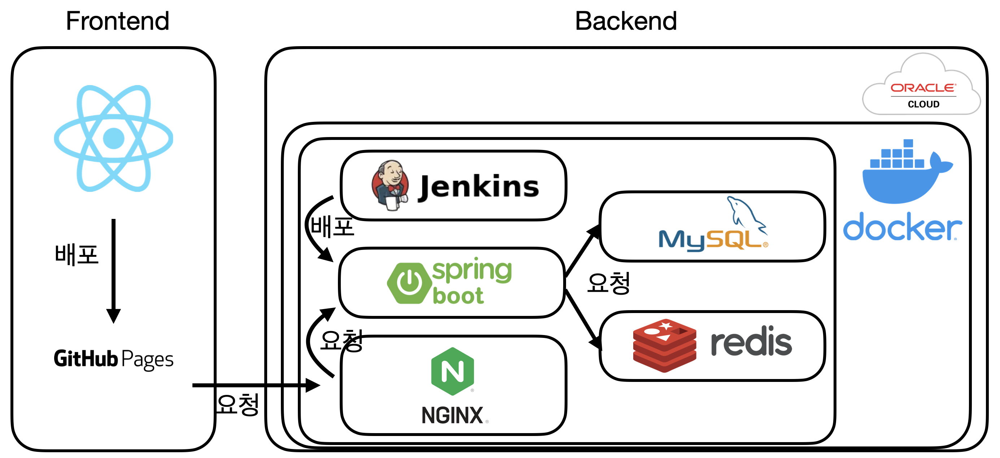

# 로또 번호 생성기_백엔드

## 소개
- 랜덤으로 생성되는 번호뿐만 아니라 통계에 기반한 로또 번호 생성기
- 역대 당첨 번호와 가장 빈도 높은 번호의 통계를 조회

## 주요 기능
- 랜덤 번호 생성
- 통계에 기반한 번호 생성
- 역대 당첨 번호 조회
- 가장 많이 뽑힌 번호 조회
- 자리별 가장 많이 뽑힌 번호 조회

## 학습 목표
- 코틀린을 이용한 스프링 부트 서버
- QueryDSL을 이용한 통계 쿼리
- 협업 환경을 가정해서 RestDocs를 이용해 API 문서 작성
- 클라우드 환경에서 Docker를 이용해 인프라를 구축
- 젠킨스를 이용한 배포 자동화

## 기술 스택
- 언어: Kotlin
- 프레임워크: Spring Boot
- 기타: JPA, QueryDSL, JUnit, Mockito, RestAssured, RestDocs, Oracle Cloud, Docker, Jenkins, Redis, Nginx, MySQL

## 설치 및 실행
```bash
git clone https://github.com/seogineer/kotlin-spring-lotto-generator.git
cd kotlin-spring-lotto-generator
./gradlew bootRun --args='--spring.profiles.active=dev'
```

## API 문서 위치
```
src/main/resources/static/docs/index.html
```

## 프로젝트 구조


## 기타 설정 파일
### 테이블
```sql
create table drawing (
    round           int    not null primary key,
    date            date   not null,
    one             int    not null,
    two             int    not null,
    three           int    not null,
    four            int    not null,
    five            int    not null,
    six             int    not null,
    bonus           int    not null,
    first_win_prize bigint not null,
    first_winners   int    not null
);
```

## 테스트용 데이터 생성
서버가 동작하는 상태에서 인텔리제이에서 아래 경로 파일을 열고 HTTP 요청을 보낼 수 있음.
```shell
src/main/resources/excelUpload.http
```

### docker-compose.yml
````yaml
services:
  jenkins:
    image: jenkins/jenkins:lts
    container_name: jenkins
    ports:
      - "8080:8080"
    environment:
      JAVA_OPTS: "-Xms512m -Xmx1024m"
    volumes:
      - jenkins_home:/var/jenkins_home
    networks:
      - project_network

  mysql:
    image: mysql:latest
    container_name: mysql
    environment:
      MYSQL_ROOT_PASSWORD: root
      MYSQL_DATABASE: LottoDB
      MYSQL_USER: 
      MYSQL_PASSWORD: 
      TZ: Asia/Seoul
    ports:
      - "3306:3306"
    volumes:
      - mysql_data:/var/lib/mysql
      - ./my.cnf:/etc/mysql/conf.d/my.cnf
    networks:
      - project_network

  redis:
    image: redis:latest
    container_name: redis
    ports:
      - "6379:6379"
    networks:
      - project_network

	nginx:
    image: nginx:latest
    container_name: nginx
    ports:
      - "80:80"
      - "443:443"
    volumes:
      - ./nginx.conf:/etc/nginx/nginx.conf
      - ./data/certbot/conf:/etc/letsencrypt 
      - ./data/certbot/www:/var/www/certbot
    networks:
      - project_network
      
	certbot:
    image: certbot/certbot
    container_name: certbot
    volumes:
      - ./data/certbot/conf:/etc/letsencrypt 
      - ./data/certbot/www:/var/www/certbot
    # entrypoint: "/bin/sh -c 'while :; do sleep 2073600; done'" # 최초 생성 후 80 포트에서 임시로 사용
    entrypoint: "/bin/sh -c 'trap exit TERM; while :; do certbot renew; sleep 12h & wait $${!}; done;'"
    networks:
      - project_network

	spring-server:
    image: kotlin-spring-lotto-generator:latest
    container_name: spring-server
    build:
      context: .
      dockerfile: Dockerfile
    ports:
      - "8081:8081"
    networks:
      - project_network

networks:
  project_network:
    driver: bridge

volumes:
  jenkins_home:
  mysql_data:
````

### nginx.conf
```conf
// SSL 인증용
events {
    worker_connections 1024;
}

http {
    server {
        listen 80;
        server_name lotto-generator.o-r.kr;

        location /.well-known/acme-challenge/ {
            root /var/www/certbot;
        }
    }
}


// SSL 인증 후 운영용
events {
    worker_connections 1024;
}

http {
    include       mime.types;
    default_type  application/octet-stream;

    ssl_protocols TLSv1.2 TLSv1.3;
    ssl_prefer_server_ciphers on;
  
    server {
        listen 80;
        server_name lotto-generator.o-r.kr;
    
        location /.well-known/acme-challenge/ {
            root /var/www/certbot;
        }
    
        location / {
            return 301 https://$host$request_uri;
        }
    }

    server {
        listen 443 ssl;
        server_name lotto-generator.o-r.kr;
    
        ssl_certificate /etc/letsencrypt/live/lotto-generator.o-r.kr/fullchain.pem;
        ssl_certificate_key /etc/letsencrypt/live/lotto-generator.o-r.kr/privkey.pem;
            
        add_header Access-Control-Allow-Origin https://seogineer.github.io;
        add_header Access-Control-Allow-Methods 'GET, POST, PUT, DELETE, OPTIONS';
        add_header Access-Control-Allow-Headers 'Content-Type, Authorization';
        
        location / {
            proxy_pass http://spring-server:8081/;
            proxy_http_version 1.1;
            proxy_set_header Upgrade $http_upgrade;
            proxy_set_header Connection 'upgrade';
            proxy_set_header Host $host;
            proxy_cache_bypass $http_upgrade;
        }
    }
}
```

### Dockerfile
```dockerfile
FROM openjdk:17-jdk-slim

COPY kotlin-spring-lotto-generator.jar /app/kotlin-spring-lotto-generator.jar

ENV SPRING_PROFILES_ACTIVE=prod

ENTRYPOINT ["java", "-jar", "/app/kotlin-spring-lotto-generator.jar"]

EXPOSE 8081
```

### jenkins execute shell
```shell
./gradlew clean build
ssh ubuntu@host-ip-address '/home/ubuntu/deploy.sh'
```

### deploy.sh
```shell
#!/bin/bash

echo "Starting the build and run process for spring-server..."

sudo docker cp jenkins:/var/jenkins_home/workspace/kotlin-spring-lotto-generator-deploy/build/libs/kotlin-spring-lotto-generator.jar /home/ubuntu

if docker ps -q -f name=spring-server; then
  echo "Stopping and removing the existing spring-server container..."
  docker compose down spring-server
else
  echo "No existing spring-server container found."
fi

echo "Building the spring-server image..."
docker compose build spring-server

echo "Starting the spring-server container..."
docker compose up -d spring-server
```
