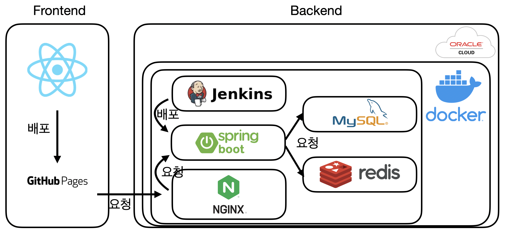

# 로또 번호 생성기_백엔드

## 소개
- 랜덤으로 생성되는 번호뿐만 아니라 통계에 기반한 로또 번호 생성기
- 역대 당첨 번호와 가장 빈도 높은 번호의 통계를 조회

## 주요 기능
- 랜덤 번호 생성
- 통계에 기반한 번호 생성
- 역대 당첨 번호 조회
- 가장 많이 뽑힌 번호 조회
- 자리별 가장 많이 뽑힌 번호 조회
- 당첨 번호 자동 갱신 (매주 월요일 낮 12시 KST)

## 번호 추천 방식
`LottoNumberGeneratorService`가 자리(1~6)별 역대 출현 빈도를 가중치(`빈도^지수`)로 각 자리를 독립적으로 뽑고, 6개가 서로 다르며 오름차순이 아니면 다시 뽑습니다.
- 지수는 `lotto.recommend.weight-exponent`로 설정합니다 (기본 `0.5`, `0`이면 관측된 번호 중 균등, 클수록 자주 나온 번호 선호).
- 뽑기에 실패하거나 데이터가 없으면 자리별 상위 5개 번호의 오름차순 조합 중 하나를 고릅니다.
- 과거 빈도는 다음 추첨의 당첨 확률에 영향을 주지 않습니다. 가중치는 추천되는 조합의 모양을 정할 뿐입니다.

## 당첨 번호 갱신
`DrawingService.fetchAndStoreLottoNumbers()`가 동행복권 결과 페이지가 사용하는 엔드포인트(`/lt645/selectPstLt645InfoNew.do`)를 호출해 DB에 없는 회차를 모두 저장합니다. DB 최신 회차 + 1부터 반복 호출(최대 50회)하므로 누락된 회차도 한 번에 따라잡습니다. 비공식 엔드포인트라 응답 형식이 바뀌면 갱신이 실패할 수 있습니다.

## 캐시와 조회 속도
- prod 프로필에서만 Redis 캐시(TTL 7일)를 사용합니다. `drawings`(키 `page:size`, `size <= 20 && page <= 300`일 때만 캐시), `mostFrequentNumbers`, `topNumbersPerPosition`, `frequenciesPerPosition` 4개를 항상 함께 무효화합니다.
- 앱 시작 직후와 갱신(엑셀 업로드, 스케줄러) 직후에 `DrawingCacheWarmer`가 첫 화면 조회를 미리 실행해 캐시를 채웁니다.

## 학습 목표
- 코틀린을 이용한 스프링 부트 서버
- QueryDSL을 이용한 통계 쿼리
- 협업 환경을 가정해서 RestDocs를 이용해 API 문서 작성
- 클라우드 환경에서 Docker를 이용해 인프라를 구축
- GitHub Actions를 이용한 빌드 자동화와 스크립트 기반 배포 (이전에는 Jenkins 사용)

## 기술 스택
- 언어: Kotlin
- 프레임워크: Spring Boot
- 기타: JPA, QueryDSL, JUnit, Mockito, RestAssured, RestDocs, Oracle Cloud, Docker, Jenkins, Redis, Nginx, MySQL

## 설치 및 실행
```bash
git clone https://github.com/seogineer/kotlin-spring-lotto-generator.git
cd kotlin-spring-lotto-generator
./gradlew bootRun --args='--spring.profiles.active=dev'
```

## API 문서 위치
```
src/main/resources/static/docs/index.html
```

## 프로젝트 구조


## 기타 설정 파일
### 테이블
```sql
create table drawing (
    round           int    not null primary key,
    date            date   not null,
    one             int    not null,
    two             int    not null,
    three           int    not null,
    four            int    not null,
    five            int    not null,
    six             int    not null,
    bonus           int    not null,
    first_win_prize bigint not null,
    first_winners   int    not null
);
```

## 테스트용 데이터 생성
서버가 동작하는 상태에서 인텔리제이에서 아래 경로 파일을 열고 HTTP 요청을 보낼 수 있음.
```shell
src/main/resources/excelUpload.http
```

### docker-compose.yml
````yaml
services:
  jenkins:
    image: jenkins/jenkins:lts
    container_name: jenkins
    restart: unless-stopped
    logging:
      driver: json-file
      options:
        max-size: "10m"
        max-file: "3"
    ports:
      - "8080:8080"
    environment:
      JAVA_OPTS: "-Xms128m -Xmx384m"
    volumes:
      - jenkins_home:/var/jenkins_home
    networks:
      - project_network

  mysql:
    image: mysql:latest
    container_name: mysql
    restart: unless-stopped
    logging:
      driver: json-file
      options:
        max-size: "10m"
        max-file: "3"
    environment:
      MYSQL_ROOT_PASSWORD: <비밀번호>
      MYSQL_DATABASE: LottoDB
      MYSQL_USER: 
      MYSQL_PASSWORD: 
      TZ: Asia/Seoul
    ports:
      - "127.0.0.1:3306:3306"
    volumes:
      - mysql_data:/var/lib/mysql
      - ./my.cnf:/etc/mysql/conf.d/my.cnf
    networks:
      - project_network

  redis:
    image: redis:latest
    container_name: redis
    restart: unless-stopped
    logging:
      driver: json-file
      options:
        max-size: "10m"
        max-file: "3"
    ports:
      - "127.0.0.1:6379:6379"
    networks:
      - project_network

  nginx:
    image: nginx:latest
    container_name: nginx
    restart: unless-stopped
    logging:
      driver: json-file
      options:
        max-size: "10m"
        max-file: "3"
    ports:
      - "80:80"
      - "443:443"
    volumes:
      - ./nginx.conf:/etc/nginx/nginx.conf
      - ./data/certbot/conf:/etc/letsencrypt 
      - ./data/certbot/www:/var/www/certbot
    depends_on:
      - certbot
    networks:
      - project_network
      
  certbot:
    image: certbot/certbot
    container_name: certbot
    restart: unless-stopped
    logging:
      driver: json-file
      options:
        max-size: "10m"
        max-file: "3"
    volumes:
      - ./data/certbot/conf:/etc/letsencrypt 
      - ./data/certbot/www:/var/www/certbot
      - ./home/ubuntu/reload-nginx.sh:/reload-nginx.sh
    # entrypoint: "/bin/sh -c 'while :; do sleep 2073600; done'" # 최초 생성 후 80 포트에서 임시로 사용
    entrypoint: "/bin/sh -c 'trap exit TERM; while :; do certbot renew; if [ $? -eq 0 ]; then /reload-nginx.sh; fi; sleep 12h & wait $${!}; done;'"
    networks:
      - project_network

  spring-server:
    image: kotlin-spring-lotto-generator:latest
    container_name: spring-server
    restart: unless-stopped
    logging:
      driver: json-file
      options:
        max-size: "10m"
        max-file: "3"
    build:
      context: .
      dockerfile: Dockerfile
    ports:
      - "8081:8081"
    networks:
      - project_network

networks:
  project_network:
    driver: bridge

volumes:
  jenkins_home:
  mysql_data:
````

### nginx.conf
```conf
// SSL 인증용
events {
    worker_connections 1024;
}

http {
    server {
        listen 80;
        server_name lotto-generator.o-r.kr;

        location /.well-known/acme-challenge/ {
            root /var/www/certbot;
        }
    }
}


// SSL 인증 후 운영용
events {
    worker_connections 1024;
}

http {
    include       mime.types;
    default_type  application/octet-stream;

    ssl_protocols TLSv1.2 TLSv1.3;
    ssl_prefer_server_ciphers on;
  
    server {
        listen 80;
        server_name lotto-generator.o-r.kr;
    
        location /.well-known/acme-challenge/ {
            root /var/www/certbot;
        }
    
        location / {
            return 301 https://$host$request_uri;
        }
    }

    server {
        listen 443 ssl;
        server_name lotto-generator.o-r.kr;
    
        ssl_certificate /etc/letsencrypt/live/lotto-generator.o-r.kr/fullchain.pem;
        ssl_certificate_key /etc/letsencrypt/live/lotto-generator.o-r.kr/privkey.pem;
            
        add_header Access-Control-Allow-Origin https://seogineer.github.io;
        add_header Access-Control-Allow-Methods 'GET, POST, PUT, DELETE, OPTIONS';
        add_header Access-Control-Allow-Headers 'Content-Type, Authorization';
        
        # 루트 접속 시 프론트엔드(GitHub Pages)로 이동
        location = / {
            return 302 https://seogineer.github.io/react-lotto-generator/;
        }

        location / {
            proxy_pass http://spring-server:8081/;
            proxy_http_version 1.1;
            proxy_set_header Upgrade $http_upgrade;
            proxy_set_header Connection 'upgrade';
            proxy_set_header Host $host;
            proxy_cache_bypass $http_upgrade;
        }
    }
}
```

### Dockerfile
```dockerfile
# openjdk 이미지는 Docker Hub에서 제공이 중단되어 eclipse-temurin을 사용
FROM eclipse-temurin:17-jre-jammy

COPY kotlin-spring-lotto-generator.jar /app/kotlin-spring-lotto-generator.jar

ENV SPRING_PROFILES_ACTIVE=prod

ENTRYPOINT ["java", "-jar", "/app/kotlin-spring-lotto-generator.jar"]

EXPOSE 8081
```

### (이전 방식) jenkins execute shell
RAM 1GB 서버에서 Gradle 빌드와 테스트를 돌리면 서비스가 크게 느려져 Jenkins 빌드는 중단했습니다. 아래 설정과 `deploy.sh`는 참고용입니다.
```shell
./gradlew clean build
ssh ubuntu@host-ip-address '/home/ubuntu/deploy.sh'
```

### (이전 방식) deploy.sh
```shell
#!/bin/bash

echo "Starting the build and run process for spring-server..."

sudo docker cp jenkins:/var/jenkins_home/workspace/kotlin-spring-lotto-generator-deploy/build/libs/kotlin-spring-lotto-generator.jar /home/ubuntu

if docker ps -q -f name=spring-server; then
  echo "Stopping and removing the existing spring-server container..."
  docker compose down spring-server
else
  echo "No existing spring-server container found."
fi

echo "Building the spring-server image..."
docker compose build spring-server

echo "Starting the spring-server container..."
docker compose up -d spring-server
```

### reload-nginx.sh
```shell
#!/bin/bash
sudo docker exec nginx nginx -s reload
```

### 빌드와 배포 (현재)
1. `main`에 push하면 GitHub Actions(`.github/workflows/ci.yml`)가 `./gradlew build`(테스트, REST Docs, bootJar)를 실행하고 jar를 아티팩트로 보관합니다.
2. 서버 반영은 `scripts/deploy-from-actions.sh`로 합니다. 최근 성공한 실행의 jar를 받아 서버에 올리고 `spring-server`만 교체합니다. 받은 jar의 커밋이 로컬 `HEAD`와 다르면 중단하고, 이미지 빌드나 기동에 실패하면 이전 이미지로 복구합니다. 롤백용으로 이전 이미지에 `prev-<시각>` 태그를 남깁니다.
3. 서버 `Dockerfile`의 베이스 이미지는 `eclipse-temurin:17-jre-jammy`입니다 (`openjdk` 이미지는 Docker Hub에서 제공이 중단됨).

### 서버 메모리 설정 (RAM 1GB)
한 서버에서 Jenkins, MySQL, Redis, 앱, nginx를 함께 돌리므로 메모리가 빠듯합니다.
- Jenkins 힙을 `-Xms128m -Xmx384m`로 제한
- `zram-config`로 압축 메모리 스왑 추가 (`sudo apt-get install -y zram-config`)
- MySQL(3306)과 Redis(6379)는 `127.0.0.1`로만 공개하고, 컨테이너 간 통신은 `project_network`로 합니다.
- 모든 컨테이너에 `restart: unless-stopped`와 로그 순환을 설정
